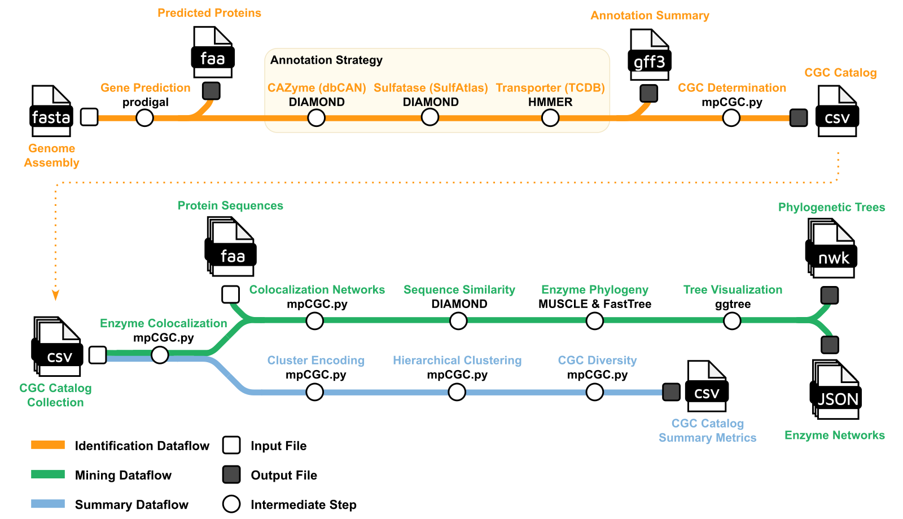

# mpCGC

**marine polysaccharide CAZyme gene clusterer**

mpCGC finds carbohydrate-active enzyme gene clusters (CGCs) in marine genomes and
MAGs, then mines and summarises them. It extends
[dbCAN](https://github.com/bcb-unl/run_dbcan), which does the gene calling, the
CAZyme/sulfatase/transporter/peptidase searches and the cluster calling, and adds
a cross-genome catalog, an enzyme mining layer and a CGC diversity layer.

It is the pipeline used to build [mpCGCdb](https://mpcgcdb.com), a catalog of
289,962 CGCs across 22,607 marine MAGs.



The pipeline has three dataflows, shown above. Identification (orange) annotates
CGCs from genome assemblies. Mining (green) builds colocalization networks,
sequence similarity networks and phylogenies from a CGC catalog. Summary (blue)
encodes clusters and produces diversity statistics. Each can run on its own with
`--step`, and all three run by default.

## Quick start

```bash
# fetch the reference databases (~8 GB, one time)
nextflow run AaronAOliver/mpCGC --step download_db --outdir refs -profile conda

# run the pipeline
nextflow run AaronAOliver/mpCGC \
    --input samplesheet.csv \
    --db refs/db/dbcan_db \
    --outdir results \
    -profile conda \
    -resume
```

## Input files

You need one file: a samplesheet. A metadata table is optional.

### Samplesheet

A CSV with a header, one genome per row.

| Column | Required | Meaning |
|---|---|---|
| `sample` | yes | Name for the genome. Must be unique. Names all its outputs and prefixes its CGC identifiers. |
| `fasta` | yes | Sequence file. What it holds depends on `--mode`. May be gzipped. |
| `gff` | only with `--mode protein` | Gene coordinates matching the proteins in `fasta`. |
| `taxonomy` | no | GTDB string. Groups genomes into lineages for diversity estimates and colours tree figures. |

Paths can be absolute or relative to where you launch Nextflow. All of them are
checked before the run starts.

### Nucleotide input: `--mode prok` or `--mode meta`

`fasta` holds nucleotide sequence and genes are called for you with Pyrodigal.
Use `prok` for a single organism (isolate genome or MAG) and `meta` for an
unbinned metagenome assembly. Only the gene-calling model differs.

```csv
sample,fasta,taxonomy
MAG_001,/data/MAG_001.fna,d__Bacteria;p__Bacteroidota;c__Bacteroidia
MAG_002,/data/MAG_002.fna.gz,d__Bacteria;p__Verrucomicrobiota
```

If you have binned an assembly into MAGs, run the bins as separate `prok` rows.
That gives per-genome CGC counts and usable diversity estimates, which an
unbinned assembly cannot.

### Protein input: `--mode protein` needs a GFF as well

`fasta` holds amino acid sequence, and the `gff` column becomes required.

```csv
sample,fasta,gff,taxonomy
MAG_001,/data/MAG_001.faa,/data/MAG_001.gff,d__Bacteria;p__Bacteroidota
```

A protein FASTA has no coordinates, and a CGC is defined by genes sitting next to
each other on a contig. Without a GFF the pipeline can annotate every protein and
still call zero clusters. The GFF supplies contig, start, stop and strand.

For the pair to work:

- Protein IDs in the FASTA header (first token) must match the IDs in the GFF.
- The GFF should be Prodigal-style. Use `--gff_type NCBI_prok` for NCBI
  annotations.
- Both files must describe the same genes. Proteins missing from the GFF are
  dropped from clustering.

Use this mode when you already have an annotation you want to keep. If you have
the nucleotide assembly, `prok` is simpler, since the gene calls then come from
the same Pyrodigal version as everything else.

### Taxonomy

Taxonomy can come from the samplesheet or a separate file. Either way it does two
jobs: grouping genomes into lineages for diversity estimates, and colouring tree
figures.

**From the samplesheet**, use the `taxonomy` column shown above.

**From a file**, pass `--metadata`. This suits larger cohorts and works with a
GTDB-Tk summary or an existing MAG statistics table:

```bash
nextflow run . --input samplesheet.csv --metadata mag_metadata.tsv --db refs/db/dbcan_db
```

The file is tab-separated with a header. Two columns are read:

| Column | Accepted headers | Meaning |
|---|---|---|
| genome ID | `Bin_id`, `sample`, `MAG`, `genome` | must match `sample` in the samplesheet |
| taxonomy | any header containing `taxonomy` | GTDB string |

```
Bin_id	Completeness (%)	Contamination (%)	GTDB_taxonomy (v207)
MAG_001	98.4	0.7	d__Bacteria;p__Bacteroidota;c__Bacteroidia;o__Flavobacteriales;f__Flavobacteriaceae;g__Polaribacter
MAG_002	95.1	1.2	d__Archaea;p__Thermoproteota;c__Nitrososphaeria
```

Other columns are ignored, so `gtdbtk.bac120.summary.tsv` works as-is.
`--metadata` takes precedence over the samplesheet column. Genomes that are
missing or unparseable go into the `other` group instead of failing the run.

### Taxonomy in tree figures

Tree tips are protein IDs, which carry no taxonomy, so the pipeline joins twice:

```
protein  ->  genome    via catalog/proteins/protein_map.tsv (written by CGC_PROTEINS)
genome   ->  lineage   via --metadata or the samplesheet taxonomy column
```

Turn the figures on and choose what to colour by:

```bash
nextflow run . \
    --input samplesheet.csv \
    --metadata mag_metadata.tsv \
    --db refs/db/dbcan_db \
    --make_tree_figures true \
    --tree_color_by taxonomy \
    --tree_color_rank phylum
```

| Parameter | Default | Meaning |
|---|---|---|
| `--make_tree_figures` | `false` | render trees; needs the `rggtree` environment |
| `--tree_color_by` | `taxonomy` | `taxonomy` or `community` (Leiden community from the sequence similarity network) |
| `--tree_color_rank` | `phylum` | `phylum`, `class`, `order`, `family`, `genus` |

At `phylum` the colours are the 11-group mpCGC palette, so tree figures match the
other mpCGCdb figures. At finer ranks, values are coloured by abundance and
anything past `--tree_max_groups` is pooled into grey. If taxonomy is
unavailable, the script colours by Leiden community instead and logs why.

Trees are built for every family with at least `--min_family_seqs` sequences
(default 4). Use `--mine_families GH16_16,PL7_5` to restrict the work. Mining
every family in a large catalog is the slowest part of the pipeline.

## Output

```
results/
├── identify/<sample>/          gene calls, all DIAMOND and HMMER hits, overview.tsv
├── identify/cgc/               per-genome cgc.gff and cgc_standard_out.tsv
├── catalog/                    all_cgc_catalog.tsv, per-genome counts, per-family proteins
├── mine/                       colocalization network, SSN communities, alignments, trees
├── summarize/                  fingerprints, clustering, co-occurrence, richness, summary csv
└── pipeline_info/              reports, timeline, trace, versions.yml
```

`docs/output.md` describes every file.

## Profiles

| Profile | Use |
|---|---|
| `conda` / `mamba` | per-process conda environments from `env/*.yml` |
| `docker` / `singularity` | containers; build with `docker build -t mpcgc:1.0.0 .` and select with `--container` |
| `slurm` | submit to a Slurm cluster |
| `local_envs` | reuse conda environments already on the host |
| `test` | one genome, identification only |
| `test_full` | two genomes, all three dataflows |

## Key parameters

```
--step                  identify | mine | summarize | all | download_db
--mode                  prok | meta | protein

CGC calling
--min_core_cazyme       minimum CAZymes per cluster            [1]
--num_null_gene         max intervening unannotated genes      [2]
--additional_genes      accessory classes required with the CAZyme core [TC]
--additional_logic      all | any                              [all]
--extend_mode           none | bp | gene                       [gene]
--extend_gene_count     flanking genes when --extend_mode gene [2]

Mining
--mine_families         restrict to a comma-separated subset   [all]
--min_family_seqs       skip families smaller than this        [4]
--ssn_evalue            DIAMOND all-vs-all E-value             [1e-30]
--leiden_resolution     Leiden resolution                      [1.0]
--make_tree_figures     render trees with ggtree               [false]
--tree_color_by         taxonomy | community                   [taxonomy]
--tree_color_rank       phylum | class | order | family | genus [phylum]

Summary
--collapse_subsets      count maximal fingerprints only        [true]
--group_by              metadata column defining lineages      [phylum]
--min_genomes           lineages below this skip rarefaction   [5]
--cooccurrence_min_cgc  min CGCs for a family to be plotted    [100]
```

`nextflow run AaronAOliver/mpCGC --help` lists them all. `docs/usage.md` documents
every parameter.

## Requirements

- Nextflow 24.04 or newer, and Java 17+
- conda/mamba, Docker or Singularity
- ~8 GB disk for the reference databases
- ~32 GB RAM for the dbCAN-sub HMM step. Lower it with `--dbcansub false`, at the
  cost of subfamily resolution.
